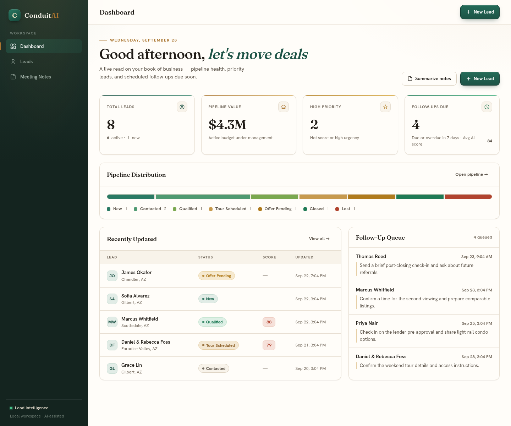
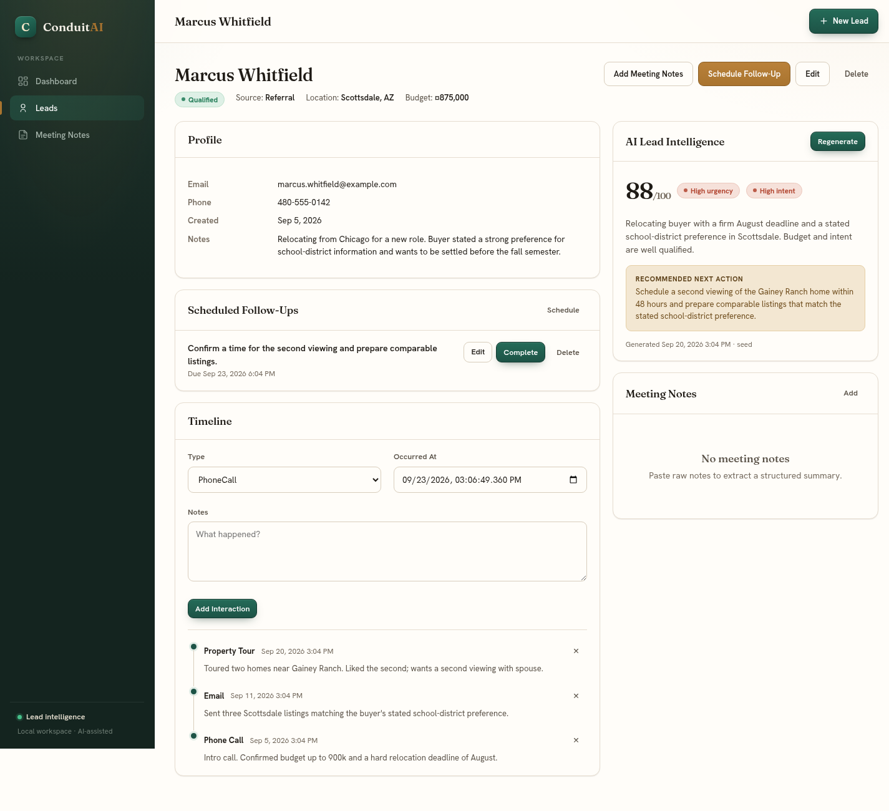
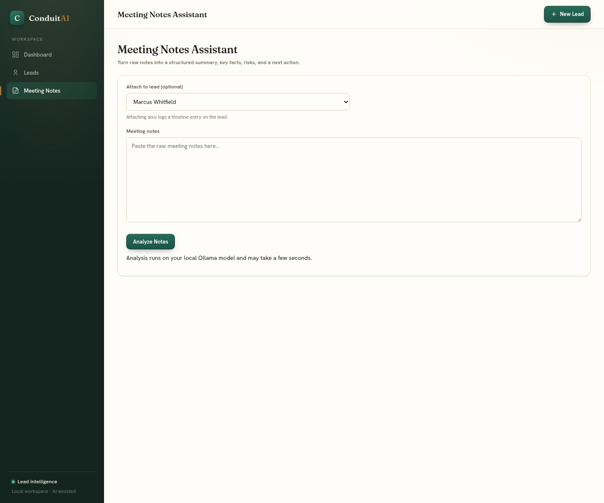

<h1 align="center">
  
</h1>

ConduitAI is an ASP.NET Core MVC application for real-estate lead intelligence and follow-up. It is an internal CRM covering lead records, timeline history, dashboard metrics, stored AI analysis, and meeting-note processing. AI runs locally through Ollama and is invoked only on explicit user actions.

Scope, architecture, and contribution rules are documented in [CLAUDE.md](CLAUDE.md) and [AGENTS.md](AGENTS.md).

## Features

- **Lead management** — create, edit, delete, list, and detail views with server-side validation and safe delete confirmation.
- **Search and filtering** — filter leads by status, source, location, free-text search, and minimum AI lead score.
- **Lead timeline** — record interactions (calls, emails, meetings, property tours, follow-ups, notes); adding one bumps the lead's last-updated time.
- **Scheduled follow-ups** — create, reschedule, complete, or remove dated actions. Lead pages show open and completed items; the dashboard counts overdue actions and those due within seven days.
- **Stored AI lead analysis** — on demand, generate a summary, 0–100 lead score, urgency, buying intent, and recommended next action. Results are persisted, never regenerated on page load.
- **Meeting notes assistant** — turn raw notes into a structured summary, key facts, risks, and a next action; optionally attach to a lead, which also records a timeline interaction.
- **Dashboard** — total leads, new leads, high-priority leads, upcoming follow-ups, a recently-updated list, and a follow-up queue.

## Engineering Highlights

- **Local-first AI integration.** Lead analysis and meeting-note extraction run against a local Ollama model over a typed `HttpClient`, using a structured JSON response contract, tolerant parsing, a single parse-and-repair retry, no automatic redirects, and graceful degradation when the model is unavailable — partial output is never persisted. Each client is limited to five model requests per minute, one active inference, and one queued inference.
- **Local-only app boundary.** The web app rejects wildcard and non-loopback listeners and accepts loopback Host names only. It has no authentication, so local processes and other users on the same computer share access to its data.
- **Defense-in-depth by default.** Anti-forgery on every POST, ViewModel binding to prevent over-posting, parameterized EF Core LINQ, and Razor output encoding for untrusted user and model text.
- **Clean MVC architecture.** Thin controllers over a focused service layer (lead, timeline, dashboard, AI analysis, meeting notes), with EF Core/SQLite persistence and migrations.
- **Progressive enhancement with jQuery.** Pages render server-side and stay fully usable without heavy client logic; jQuery layers on the explicit, user-triggered AI analysis AJAX call (`ai.js`) and safe delete/confirmation flows (`site.js`), plus jQuery Validation Unobtrusive for client-side form checks — and AI output is inserted via `.text()`/DOM APIs, never as raw HTML.
- **Tested behavior.** xUnit coverage across the service layer, lead filtering, AI JSON parsing, and AI/meeting-note failure paths.

## Technology Stack

- ASP.NET Core MVC (.NET 10 LTS) with Razor views
- C#
- Entity Framework Core 10.0.12 with SQLite
- HTML / CSS / JavaScript / jQuery (progressive enhancement)
- Ollama running locally at `http://localhost:11434`

## Prerequisites

- [.NET 10 SDK](https://dotnet.microsoft.com/download/dotnet/10.0)
- [Ollama](https://ollama.com/) for AI features (the rest of the app works without it)

## Getting Started

```bash
dotnet tool restore
dotnet restore
dotnet run --project ConduitAI --launch-profile http
```

The app applies EF Core migrations and seeds fictional demo data, including scheduled follow-ups, on first run, so a separate `dotnet ef database update` is not required. The SQLite database is created under the app content root at `ConduitAI/App_Data/conduitai.db` (git-ignored), regardless of the shell's working directory.

Then open `http://localhost:5229`. The `https` launch profile also uses localhost.

### Enabling AI features

AI actions (lead analysis, meeting notes) require Ollama running locally with the configured model:

```bash
ollama serve
```

In another terminal:

```bash
ollama pull qwen2.5-coder:7b
ollama list
```

If Ollama is unavailable, configured to a non-local URL, or returns unparseable output, AI actions fail gracefully with a user-facing message and nothing partial is stored. All other CRM features remain fully usable.

### Screenshots

These screenshots use the fictional first-run seed data:







## Configuration

Ollama settings live in `appsettings.json` under the `Ollama` section:

```json
"Ollama": {
  "BaseUrl": "http://localhost:11434",
  "Model": "qwen2.5-coder:7b",
  "TimeoutSeconds": 120
}
```

`appsettings.json` holds public-safe defaults. To use a different local model without changing committed files, override with environment variables:

```bash
Ollama__Model=qwen2.5-coder:14b dotnet run --project ConduitAI
```

AI requests are only sent to loopback Ollama URLs such as `http://localhost:11434` or `http://127.0.0.1:11434`. Non-loopback URLs disable AI features instead of sending private lead data off-machine.

The application only binds to localhost or a loopback IP and rejects other Host names. Keep it local: do not expose it through a proxy, tunnel, shared host, or network interface. ConduitAI has no authentication or user roles, and every local process or user on the computer can access the same data file. Protect the computer and local database accordingly.

To use a different local database file, override the connection string without editing tracked settings:

```bash
ConnectionStrings__DefaultConnection='Data Source=/path/to/conduitai.db' dotnet run --project ConduitAI --launch-profile http
```

No secrets are required to run the app.

## Project Structure

```
ConduitAI/
  Controllers/    Thin controllers (Home, Leads, Interactions, FollowUps, Ai, MeetingNotes)
  Services/       Business logic + interfaces and AI result types
  Models/         EF Core entities and enums
  Data/           AppDbContext, design-time factory, seed initializer
  Migrations/     EF Core migrations
  ViewModels/     Form and display models (prevent over-posting)
  Views/          Razor views and partials
  Helpers/        Display formatting helpers
  wwwroot/        site.css, site.js, ai.js, fonts, jQuery validation
ConduitAI.Tests/  xUnit coverage across service behavior, filters, and AI flows
.config/          Pinned dotnet-ef local tool manifest (10.0.12)
screenshots/      Fictional seeded-data screenshots
```

### Service layer

- `LeadService` — lead CRUD, filtering, and pagination
- `FollowUpService` — scheduled follow-up lifecycle and local/UTC conversion
- `TimelineService` — interaction history
- `DashboardService` — dashboard metrics
- `AiAnalysisService` — generates and stores lead analysis
- `MeetingNotesService` — processes and stores meeting notes
- `OllamaClient` — typed HttpClient wrapper for the Ollama API
- `AiPromptBuilder` / `AiResponseParser` — structured prompt construction and tolerant JSON parsing

### Data model

SQLite tables: `Leads`, `LeadInteractions`, `LeadAnalyses`, `MeetingNotes`, and `LeadFollowUps`. AI results are stored for auditability rather than overwritten or regenerated automatically. Meeting notes and follow-ups attached to a lead are deleted with that lead; unattached notes are only created through the standalone meeting-notes workflow.

## Testing

```bash
dotnet test
```

Tests cover service behaviors, search and pagination, local-only listener validation, follow-up due windows and lifecycle, migration from the prior SQLite schema, AI response parsing, Ollama limits, and meeting-note failure paths.

## Security & Privacy

This project is built for a public repository, so security is part of the design:

- No secrets, tokens, passwords, real customer data, or private notes are committed; local databases, logs, and secrets are git-ignored.
- Input is validated server-side with DataAnnotations and service-level checks.
- POST forms use anti-forgery tokens; forms bind to ViewModels, not database entities.
- Persistence uses EF Core LINQ and parameterized queries.
- User input and AI output are treated as untrusted and rendered with Razor's default HTML encoding (never as raw HTML).
- Prompts instruct the model not to invent facts and to avoid legal, financial, or protected-class recommendations.
- Raw notes, emails, phone numbers, and full AI responses are kept out of logs.

## Fonts

Fraunces and Hanken Grotesk are self-hosted under the SIL Open Font License 1.1. Font attributions and the complete license text are in [OFL.txt](ConduitAI/wwwroot/fonts/OFL.txt).

## Constraints

By design, ConduitAI is free to run and develop and adds no authentication, roles, Docker, microservices, Redis, queues, cloud infrastructure, CI/CD, paid APIs, or hosted LLM services. Seed data is fictional.

## License

ConduitAI is licensed under the MIT License. The remaining third-party client libraries in `wwwroot/lib` include their own license files; unused Bootstrap assets were removed.
